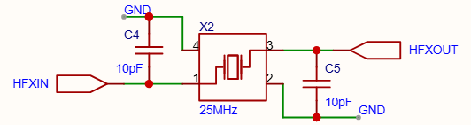

---

title: MSPM0G3507单片机必要电路设计

published: 2026-03-27

pinned: false

description: 从芯片开始的单片机设计教程

tags: [Markdown, Blogging,MCU]

category: MCU

licenseName: "Unlicensed"

author: 奶黄包-CrowVoice

draft: false

date: 2026-03-27

pubDate: 2026-03-27

---

# 前言

由于电赛将至，为了避免电赛题目限制TI的主控板而导致前功尽弃的情况，我特意设计了以MSPM0G3507为主控的信号处理专用的开发板。在成功运行后特此写下此篇文章分享以芯片为基准，而非现成系统板的PCB设计方法。

# 必要电路

因为是以芯片为基准，一些必要的外围电路自然是重中之重。如果缺乏任意一个电路，都有可能导致芯片没法正常工作。

## 外部晶振

外部晶振作为单片机的心脏必须要重视。其中单片机一般会有两个外部晶振，分别是**低速晶振**和**高速晶振**。

高速晶振

低速晶振

由于本身MSPM0G3507的芯片性能一般，所以没必要在这颗芯片上大费周章使用有源晶振。于是我选用了无源晶振作为芯片的外部晶振。

注意，外部晶振一般IN和OUT引脚都会有一个匹配电容并联到GND，关于这个电容的大小具体可参考数据手册。不过一般在购买晶振时商家都会标好，建议购买时注意。

购买界面

同时外部晶振在PCB设计时，必须尽可能靠近芯片，以保证时钟信号的纯净。

**与晶振同一层的底部铺铜必须挖空，同时严禁走线。**在晶振底下一层的铺铜可视情况挖空，如果担心热传导影响晶振性能，可挖空底下一层的铜皮。不过一般热传导的影响不会太大，而且这样还会导致晶振底部的参考平面消失，所以一般建议只挖空同层的铜皮就好。

## ROSC电阻

为了给芯片内部的**频率校正环路**提供一个精准的基准电流，用于保证芯片内部时钟的准确度，必须在ROSC引脚连接一个**高精度电阻**到GND。

一般建议选择0.1%精度的电阻。

## 复位电路

**为避免意外情况的发生，十分建议将芯片的复位引脚引出到外部接口或按钮上。**这样在遇到芯片卡死的情况时无需频繁插拔电源来进行掉电复位。

同时建议复位电路进行硬件滤波，避免杂波导致反复复位。

复位按钮

## VCORE电容

为了保证**内部内核稳压器的正常输出**，必须在VCORE引脚外接一个**低ESL的470nF的电容**到GND。

## 烧录引脚

为了将程序烧录到芯片中，必须将芯片的SWCLK、SWDIO、芯片供电、GND引脚引到外部引脚用于烧录器的连接。

## BSL引脚

由于MSPM0G3507的芯片在使用过程中有可能会出现锁芯片的情况，如果身边没有XDS烧录来解锁芯片的话，可以通过控制BSL引脚的高低电平来让芯片进入系统BootLoader来进行程序的烧录。

## 电源

建议芯片供电采用LDO来进行供电，LDO的纹波远小于DCDC，能保证芯片的工作稳定。

