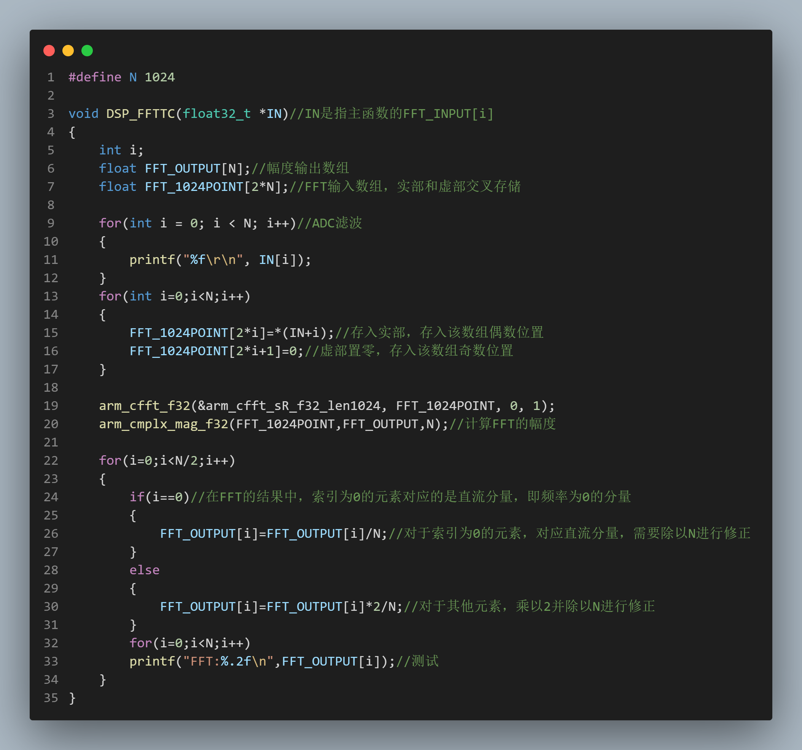

---

title: STM32程序通过设置栈内存处理HardFault_Handler
published: 2026-02-12
pinned: false
description: 关于HardFault_Handler卡死的解决方法.
tags: [Markdown, Blogging]
category: Examples
licenseName: "Unlicensed"
author: 奶黄包-CrowVoice
draft: false
date: 2025-11-09
pubDate: 2026-02-12

---

# 前言

在复刻2020年电赛E题时，写了一个fft求幅值的函数，理论上代码不存在什么问题，但每次运行总是会卡死，经过debug一看原来是代码在进入求幅值的函数时进入了**HardFault_Handler**函数，导致程序卡死，故借此文章来分享解决经验。

# 示例代码

如图所示，这是我写的关于fft求幅值的函数，但是每次在运行到该函数时总是会进入HardFault_Handler函数卡死。于是我们可以从HardFault_Handler的运行原理入手，HardFault_Handler的卡死情况一般有很多种，其中**栈溢出**便是一种。

# 解决方法（栈内存设置）

我们找到工程中startup_stm32h743xx.s（不同型号的名称不同，一般命名都是**startup_stm32（对应型号）xx.s**，例如STM32F407ZGT6就是startup_stm32f407xx.s，）。

打开文件后往下翻找到**Stack_Size**，可以看到栈的大小设置默认为0x0400。

当然也可以在文件页面左下角找到Configuration Wizaard并点开，就能直接找到了。

栈的大小是按照16进制计算的0x0400即是1024bit，对应1KB大小。我们在此设置为0x3000之后，程序再次烧录便能正常运行了。

# 程序错误解析

STM32默认栈的大小设置为**0x0400**，即**1KB**。而我的fft函数中的**FFT_OUTPUT**、**FFT_1024POINT**的大小分别设置为**1024**和**2048**，根据计算可知大小分别为**4KB**、**8KB**，这明显已经超出栈的大小。于是我们可以通过两种方式解决问题：**减少栈的占用**或**提升栈的大小。**

考虑到数据大小的改变可能会带来各种问题，故采用更稳妥的方法，即提升栈的大小。

当然，栈的大小设置受限于硬件，如果芯片的栈的大小实在是不够，可通过减小栈的占用来解决问题。此处只需要将**FFT_OUTPUT**、**FFT_1024POINT**的大小设置为**128**和**256**即可。