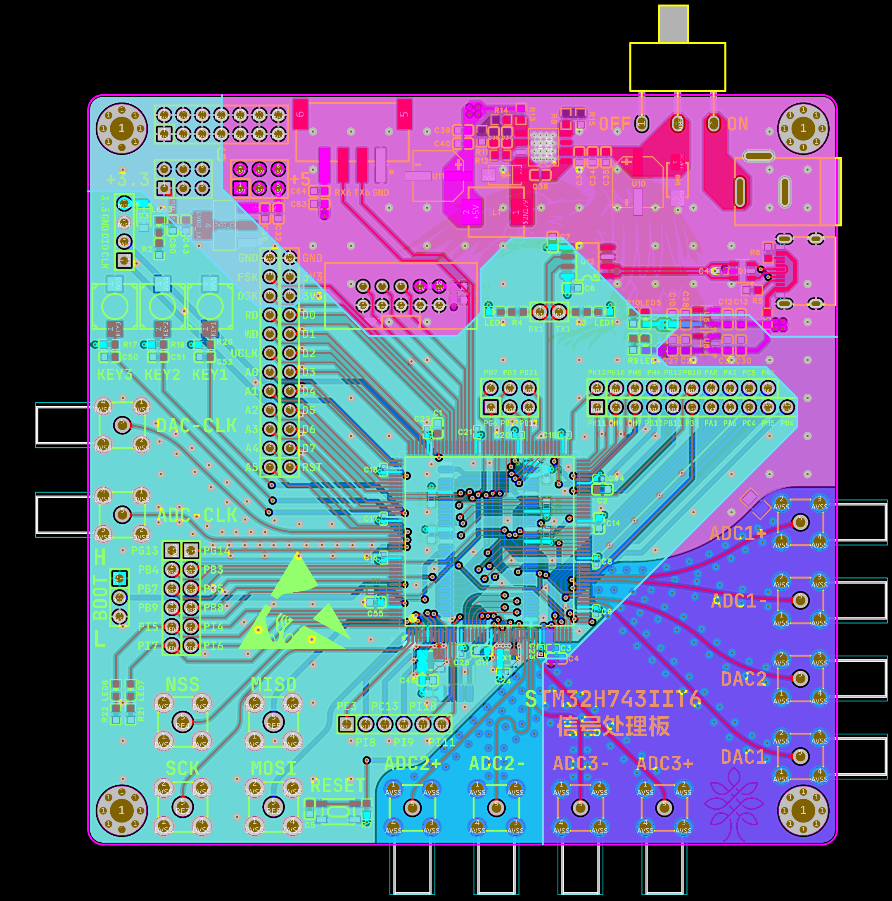
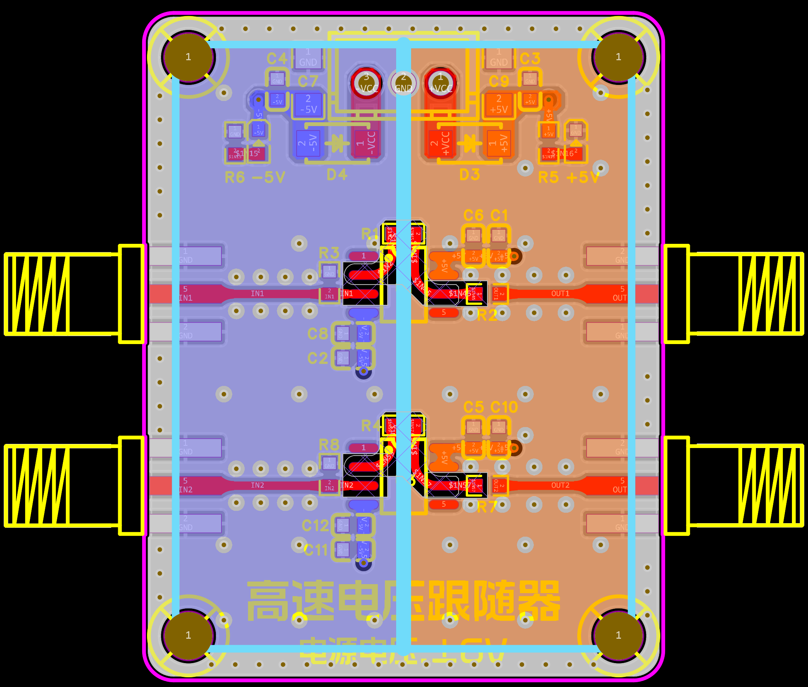
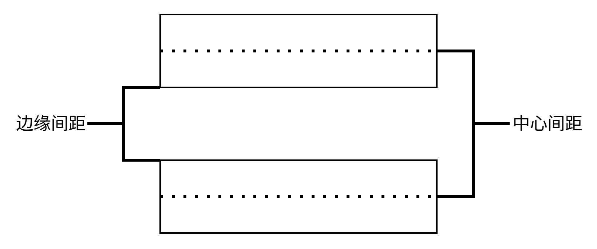

---

title: PCB设计相关技巧

published: 2026-10-06

pinned: false

description: 分享PCB设计时的一些简单技巧.

tags: [Markdown, Blogging, PCB]

category: Guides

licenseName: "Unlicensed"

author: 奶黄包-CrowVoice

draft: false

date: 2026-10-06

pubDate: 2026-10-06

---

# 前言

考虑到在硬件设计中，一些细节或是相对高级一点的知识往往资料不如软件好找，故借此文章分享我在作为硬件党的一些拙见，希望能帮到有需要的人。

# 高多层PCB

## 平面分割

电源平面的分割务必保证**够大、够连续、够集中。**

即在分割的时候不能让平面像一个“八爪鱼”，形状足够简单。

一个电源最好只占用一个平面，不要超过2个以上，东一片西一片的。

不同电源平面的间距最好保证大于20mil，具体间距要视电压差而定。

## 平面完整性

平面完整性简而言之就是保证电源平面完整、连续，不要让平面过于”破碎“。

## 20H原则

一般电源平面距离板框最好相隔一定距离，一般会选层间距的20倍，即20H原则。

例如当相邻层的间距为1mil的话，电源层最好保证距离板边20mil或以上。

## 边缘包地

电源层的边缘最好用GND包围，可以在保证电源层满足20H的情况下实现。

## 跨分割

走线一般会以相邻层作为参考平面，以常见的四层板设计为例：顶层-信号、内层1-GND、内层2-电源、底层-信号。一般电源层会分为很多个平面，而底层又会以电源层作为参考平面，所以在底层走线时务必保证一条走线不要跨越不同的电源平面。

# PCB通用设计

## 走线间距

一般为保证减少串扰，尽量保证保证3W间距，能够减少70%以上的串扰。5W间距时，可以减少90%的串扰。注意3W原则是指**走线中心之间的间距而不是走线边缘间距**，所以在EDA设置设计规则时只需设置2W的安全间距，在正式布线时便能做到3W间距布线。

## GND过孔

一般在设计PCB的最后阶段会在GND铜皮上再加上很多过孔，作用是**减少信号的回流路径**。可以理解为噪声提供更多的路线，让噪声不用“绕弯路”。GND过孔不用集中的放置在某一个位置，其作用和一个过孔相比只是强了一点而已。最好均匀放置“**缝合孔**”，能有效减少回流路径。

过孔集中

过孔分散

## 布局设计

在元件布局时务必保证：**不同元件要独立放置，不要混在一起。模拟、数字、功率等要做好明显的分区放置。**此举旨在**提升元件美观度，降低维修难度，减少不同元件之间的干扰。**

## GND分割

在存在多种混合信号的PCB上，一般要通过对GND进行分割以实现对干扰的隔离。

常见的方式是对于不同GND分隔开后通过一个**0Ω电阻、磁珠、焊锡**进行汇合，同时最好顶层和底层都要同时分割。

但是一般**GND的分割不应该过于随便**，应时情况而定。GND的分割会导致**回流路径的增加，增加寄生电感**，在**已经做好分区且距离足够远**的情况下完全没有必要分割GND。哪怕是对于信号极为敏感的ADC芯片在设计模块时也是不建议进行数模地的分割。因此，务必记住：**分区>分地**。在做好分区和保持间距的情况下不应对GND分隔。

## 盘中孔

在打过孔的时候应注意不要将过孔打在贴片焊盘中央，因为这样可能会导致在焊接时焊锡通过过孔流走导致**焊接不良**。但是如果是在有树脂塞孔工艺的PCB上可以不考虑这点。

## 走线角度

走线的拐角最好不要直接使用直角布线，一般在高频情况下会对信号造成很大的影响。

常见走线角度一般有90°、45°、圆弧等，一般来讲圆弧是最好的。但是实际上这**并不是什么真理**，因为走线的角度在不同的情况下是会有不同影响的，在一些**特殊情况**下反倒是直角对信号会比较好。

## **传输线特性阻抗**

**传输线特性阻抗≠走线阻抗≠负载阻抗**，这是理解这一概念必须了解的。传输线特性阻抗具体是指**单位走线的特性阻抗**而非整条走线的阻抗。在布线时务必保证整条走线的阻抗一致，如果走线的阻抗发生了较大的改变时会导致信**号的反射，严重影响信号质量。**

走线的特性阻抗并不是只和走线宽度有关，可能与过孔、近端串扰等外界因素有关，不应简单的认为走线宽度一致就等于走线阻抗一致。

## 电路保护

电路保护是保证产品稳定的重要手段，包含过流保护、过压保护、欠压保护、防反接、防静电、过热保护等。此部分不过多赘述，可自行上网了解。

## 时序同步

**时序同步是为了保证走线延时一致，而不是走线长度一致。**

在对并行处理的芯片进行布线时，应注意保证3W间距，特别是蛇形布线时走线自身与自身的间距务必保证3W间距。如果间距较小，在近端串扰的影响下会导致走线阻抗跌落严重、延时相差过大。

# 电源设计

## DCDC电感

DCDC的电感铺铜可以参考我的另一篇文章：

- [查看 DCDC 电感铺铜说明](https://crowvoice.github.io/posts/design-of-dcdc-buck/)
    

## 电源输出反馈走线

电源的反馈引脚走线应尽可能短，同时不要偷懒直接与输出部分一样采用大面积铜皮，因为这可能会导致反馈走线化身天线吸收外界干扰。

## 电源走线

电源走线尽可能**短、直**，这样可以减少寄生电感提升电源稳定性。同时走线可以设粗一点，因为低阻抗线路电感较低，可快速传输功率，因为线路上电流随时间的变化率等于电压除以电感：$V = L\frac{di}{dt}$。较低的电感使电流能在更短时间内升至更高值，在数字器件输出电平变化时能保证稳定性。

## 电源滤波

电源滤波部分一般通过在芯片旁并联电容实现，如下图所示，电容大小越小，其频率响应增益最低点的频率也越高，电容越大则反之。一般为了拓宽有效滤波频率范围会通过并联多个不同容值大小的电容。

同时电容越小，去耦半径越小，所以小电容相较大电容应尽可能靠近用电器。

同时如上图所示，电容对于频率超过电容频率响应增益最低点的信号实际上呈现的是**感性**，也就是说在多个电容并联时实际上有可能发生**并联谐振**，导致对于特定频率的信号**对地阻抗无限大**，在频谱图上呈现为一个极点。因此，在如射频等对电源稳定性要求较大的场合，电容的大小选择需要仔细考虑。

如果电源稳定性要求较大，同时实在不想在电容大小选择上花太多时间的话，可以直接选择用多个大小相同的电容并联，此时依然可以提升滤波效果同时没有谐振的烦恼，但仍需注意安装电感和平面谐振等问题。

电容还能作为电荷的储存元件，当芯片工作时，某个引脚输出电平从地跳至电源时，会在一瞬间从电源引脚抽取很多电荷，此时靠近电源引脚的电容则能为电源快速提供电荷保证元件正常工作。

## 电流消耗

电流的消耗一般会被初学者忽略，用电器在工作时是会消耗电流的，**当电源所能提供的最大电流无法满足用电器需求大的话可能导致用电器无法正常工作**。因此在选型阶段就必须仔细查看用电器的最大耗电流，选择满足要求的电源，同时最好**保有余量**。

## 测试点

PCB上最好加几个测试点方便生产后排查PCB问题。

# 寄生参数

## 运放电路

运放一般对于寄生电容较为敏感，所以在特定位置必须完全挖空铜皮减少寄生电容。

运放的输入和输出引脚附近的铜皮，负反馈走线附近的铜皮都是需要完全挖空的，一般最好保证间距不小于20mil。

## 晶振铺铜

如下图所示的无源晶振振荡电路，无源晶振实际上是和芯片内部的电路共同工作实现震荡的，一般画板子时只需要考虑晶振和两个并联的谐振电容就行。

**无源晶振**的谐振电容一般都很小，在pF级别，所以在铺铜时必须保证挖空自身相邻层的铺铜，以减少寄生电容，避免晶振无法正常工作。

不过如果是**有源晶振**的话就不用考虑这些，因为有源晶振已经在内部集成好了振荡电路，芯片只需要负责接收就行，所以不建议挖空铜皮，因为这样会导致晶振没有完整的GND平面。

## 回流路径

回流路径就是信号电流从接收端返回源端的闭合通路。电流总是走阻抗最小的路径。

一般为了保证信号质量，必须尽可能简短回流路径，例如放置GND过孔、减少走线面积等。

## 热传导

元件工作时一定会产生热，部分元件可能会对温度的变化较为敏感，例如晶振等。所以在画板子时务必注意当热敏感器件靠近发热量较大的元件时务必减少热传导的可能。例如**挖空铜皮、挖槽**等措施。

# 模块化设计

## 电平协议

不同元件的电源电压不同，很可能存在电平协议不同的情况，一般芯片的高电平是与电源电压一致的。例如芯片A的电源电压为5V，芯片B的电源电压为3.3V，那么这两个芯片的高电平则分别为5V、3.3V。

这在两个芯片之间存在联系的时候尤为重要，如果芯片A和芯片B需要互相通信，那么芯片B发出的逻辑高电平可能无法被芯片A接收到，但是反过来芯片A向芯片B发送逻辑高电平的话，则有可能因为**电压过高**导致芯片B**损坏**。

## 面向用户

设计产品时需要考虑用户，因为用户和设计师的思想是**不互通**的。

市面上的商业电子产品，仔细深究往往存在不少的细节问题，例如为了按钮整齐而导致其它走线而不得不走远路、为了提升产品兼容性引出了许多用不到的接口、为了降低产品大小而导致信号线挤在一块、将产品模块化而导致性能下降等。这些操作固然是对于产品性能的严重削减，但是细想一下却也是设计师必须要做出的妥协。产品不好看可能导致客户不喜欢产品，产品接口少导致部分用户到手没法用，产品太大没位置太占位置于是被用户抛弃、产品出问题损坏后维修难度高导致投诉变多等这些情况都是**很现实的问题。**

**因此产品的设计不能只认为自己的客户是和自己心有灵犀的技术人员，在设计与完善产品的同时必须考虑到能否满足大部分客户需求。**

# EDA设计技巧

## 网络颜色

一般在设计较为复杂的PCB时，许多的网络飞线会导致画面杂乱，特别是电源线等飞线特别多的网络。但是如果单纯将网络飞线关闭的话又可能会导致最后走线时不经意间忽略掉这些网络，因此可以对较多重复的网络进行调色然后再关闭对应飞线。

未改色&关闭飞线前

改色&关闭飞线后

## 插件

一般EDA软件都会有一些插件可以下载，这些插件可以在一定程度上提升效率，很值得去下载一下，特别是嘉立创EDA目前的插件发展也是很不错的的。