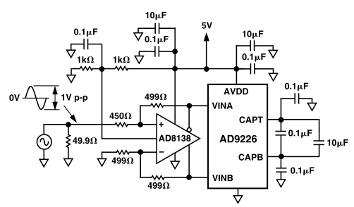

---

title: ADC设计经验总结
published: 2026-3-18
pinned: false
description: 关于我PCB设计生涯的ADC设计经验分享
tags: [Markdown, Blogging,PCB]
category: PCB
licenseName: "Unlicensed"
author: 奶黄包-CrowVoice
draft: false
date: 2026-3-18
pubDate: 2026-3-18

---

# 前言

由于我的队伍选择以FPGA作为信号处理的主控，于是ADC模块的设计便成为了当下的重中之重。在设计了AD9226、AD9238、AD9248之后，特此写下此篇文章用于总结ADC设计过程中我的经验。

# 前端调理

## 差分输入

ADC芯片往往需要将模拟信号以相位差180°的形式，进行差分输入以最大发挥ADC芯片的性能。虽然一般单端输入也能正常工作，但是会使芯片的工作性能大打折扣。

差分输入演示

## 输入范围调整

ADC芯片的信号输入峰峰值往往比较小，通过全差分运放进行衰减，实现芯片实际输入信号峰峰值在允许范围内，同时也可提升模块输入信号的范围。

## 阻抗匹配

如有需要，可对输入部分进行阻抗匹配。关于全差分运放的输入阻抗匹配教程详情请见：

[https://www.bilibili.com/video/BV1bD4y1i7Ze/?spm_id_from=333.337.search-card.all.click&vd_source=ad814c6f87b0245055d714514fc2d199](https://www.bilibili.com/video/BV1bD4y1i7Ze/?spm_id_from=333.337.search-card.all.click&vd_source=ad814c6f87b0245055d714514fc2d199)

## 电源

**运放供电务必正负电源都要接上，因为在输出信号接近电源轨的时候输出会有问题。**如果觉得输出信号范围在0~5V之间而选择只接+5V和GND的话，因为常见的前端运放输出信号的中心电压都是在1V左右，在输入信号幅度较大时，输出信号可能会因为输出接近电源轨而导致实际输出电压与理想输出电压存在较大差距。

## 输出保护

在输出高速信号时，可能会因为高速信号的反射导致“摆锤效应”的产生，进而损坏元器件。因此需要在靠近输出引脚的位置放置一个**10Ω ~ 50Ω**的小电阻用于保护元器件。

## 保持电容

一般为了帮助电压更快建立，会在前端运放的输出部分并联一个小电容。但是在中频采样时会减少带宽，此时便需要去除保持电容。

## 完整示例

# 芯片设计

## 工作模式设置

一般ADC芯片会有很多不同设置功能，例如输出格式选择、时钟稳定器使能、参考电压选择。

ADC芯片一般能选择不同的输入信号峰峰值，建议将峰峰值选择大一点，虽然会导致性能略微下降，但这样输入信号的限制会小很多，权衡利弊之后，依然建议选择较大的输入信号峰峰值。

数据输出格式一般可选择为**二进制、偏移二进制、补码二进制**，不同的数据输出格式可根据自身需求进行选择，建议将引脚引出方便随时切换数据格式。

## 输出等长

一般芯片的数据输出走线应尽可能地短，减少外界干扰。但是如果在高速采样时，可能会需要进行等长布线以做到时序同步。

常见等长方式有**Z形布线**和**蛇形布线**。

Z形布线

蛇形布线

**在等长布线时，尽量遵循3W原则，减少耦合路径，走线长度也要尽可能的短。**

## 输出保护

同上，在输出高速信号时，可能会因为高速信号的反射导致“摆锤效应”的产生，进而损坏元器件。因此需要在靠近输出引脚的位置放置一个**10Ω ~ 50Ω**的小电阻用于保护元器件。

## 电源滤波

为了让芯片正常工作，**芯片的电源引脚附近务必添加去耦电容**。电容应尽可能靠近引脚，电容越小，靠近的距离就应越近。

在放置去耦电容时，可能会出现去耦电容缺少位置放置的情况出现，此时也可考虑将电容放置到PCB背面来进行滤波。但这种情况应尽可能避免，尽量在电容不得不为布线让位的情况下再将电容放置到背面。同时走线必须保证短。

# 整体布局

## GND划分

**一般ADC、DAC采样板不建议划分为AGND、DGND等多个GND，直接在一个GND上进行元件放置，只有在特殊情况下才建议划分AGND、DGND。**

因为实际上ADC、DAC芯片的模拟信号与数字信号会产生的干扰较小，即使在同一个GND上，干扰也是很小的。而且一般芯片已经对于模拟信号和数字信号进行了分区，两种信号之间的距离也比较远。

如果划分AGND、DGND，反倒会导致寄生电感提升，影响信号质量。

详细请见ADI官方的AN-1142文件：

[AN-1142_高速ADC PCB布局布线技巧.pdf](AN-1142_%E9%AB%98%E9%80%9FADC_PCB%E5%B8%83%E5%B1%80%E5%B8%83%E7%BA%BF%E6%8A%80%E5%B7%A7.pdf)

## 信号隔离

一般重要信号建议通过在两侧放置接地过孔来进行包地处理，能有效减少信号干扰。尤其是输入信号与芯片的时钟信号需尽可能保证信号的高质量。

一般过孔间距越小，效果越好。但是一般不建议低于50Mil，因为这样反倒会引入**寄生电感**，影响信号质量。

出于信号质量考虑，**一般建议过孔之间的间距保持在50~100Mil。**