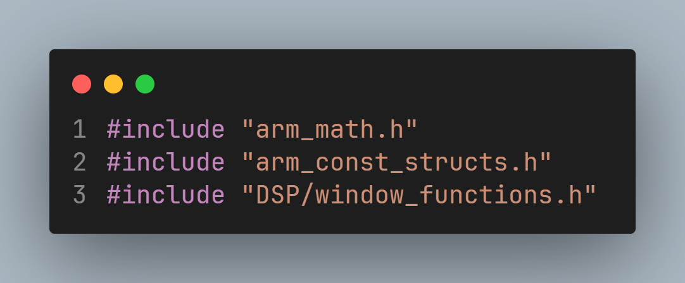

---

title: 基于STM32H743的DSP库移植方法
published: 2026-02-12
pinned: false
description: DSP库移植教程.
tags: [Markdown, Blogging]
category: Examples
licenseName: "Unlicensed"
author: 奶黄包-CrowVoice
draft: false
date: 2025-11-24
pubDate: 2026-02-12

---

# 基于STM32H743的DSP库移植方法

# 前言

之前在移植DSP库的时候因为网上的各种资料参差不齐，而且本人还要使用VSCode进行程序编写，而网上关于DSP库在VSCode上的移植教程又很少，故以此文章介绍Keil5和VSCode都能完美运行的DSP库移植方法。

# CubeMX直接添加DSP库（不推荐）

**并不推荐此方法，因为CubeMX上的DSP库更新速度很慢，我写下此文章时依旧只更新到1.4.0版本。**但考虑到此方法最为简单，故在此简单介绍一下。

如上图所示，新建工程后，点击打开上方的SoftWare Packs，选择Select Component选项。

此时会出现一个新窗口，找到STMicroelectronics.X-CUBE-ALGOBUILD,并点击Install进行下载安装。

下载完毕后，勾选DSP Library。

此时直接生成工程，DSP库就能正常使用了。

# Keil5添加DSP库（推荐）

**通过keil5添加DSP库，优点是版本更新快，一般都是最新版本。**不过后续操作相对**复杂**，特别是想要在**VSCode**上完美运行还需要更多操作。如果你是全程用**keil5**进行开发的话，移植操作倒不会复杂多少。

## Keil5部分

### 添加DSP库

用keil5打开对应工程文件，并在左上角点击并打开如图所示选项。

在弹出的界面中找到CMSIS分类，找到DSP选项并打勾，最后点击OK确定即可。初次添加可能要下载。

**注意，此时DSP库已被添加至工程文件中，但是并未被成功调用，需要手动添加必要文件路径。**

**一般文件路径为：工程文件名称\Drivers\CMSIS\DSP\Lib\ARM**

<aside>
💡

**注意，此时选择的文件根据单片机芯片存在区别**

- **arm_cortexM7b_math.lib：**大端模式，不支持浮点加速
- **arm_cortexM7bfdp_math.lib：** 大端模式，支持双精度浮点加速
- **arm_cortexM7bfsp_math.lib：** 大端模式，支持单精度浮点加速
- **arm_cortexM7l_math.lib：** 小端模式，不支持浮点加速
- **arm_cortexM7lfdp_math.lib：** 小端模式，支持双精度浮点加速
- **arm_cortexM7lfsp_math.lib：** 小端模式，支持单精度浮点加速

**STM32默认使用小端模式，并且我们的H7支持双精度浮点加速，故我们选择"arm_cortexM7lfdp_math.lib"**

</aside>

### 添加预编译宏

在预编译宏的位置添加：**USE_HAL_DRIVER,STM32H743xx,ARM_MATH_MATRIX,ARM_MATH_LOOPUNROLL,ARM_MATH_CM7,DATA_IN_ExtSDRAM,USE_PWR_LDO_SUPPLY**

### 引用头文件

在工程开头填入以上代码，引用必要的头文件，其中**#include "DSP/window_functions.h”**编译时可能会报错，鉴于一般较少用到窗函数，此处可以直接注释掉。

## VSCode部分

在完成Keil5部分的内容后，虽然Keil5可以正常编译了，但是在VSCode中出于路径索引的问题，仍会存在很多报错，这也是现在网上很多文章经常忽略的部分。

### 文件索引

直接添加以下两行代码即可：

`- ../Drivers/CMSIS/Include`
`- ../Drivers/CMSIS/DSP/Include`

添加文件包含路径后编译文件，VSCode会发生报错，显示无法打开对应文件，这就是C/C++插件的问题。此时打开命令面板或者直接Ctrl+Shirt+P，按顺序点击如图标示部分。

在图中框住的部分添加以下代码：

`"..\\Drivers\\CMSIS\\DSP\\Include"`

之后再用VSCode编译，此时VSCode便能正常工作了。

### 注意事项

在VSCode部分，添加文件包含路径是对于所有文件通用的。如果自己新建了其他包含.c和.h的文件夹，则重复将对应文件的路径按照DSP库的添加步骤即可。

# 后记

此篇文章旨在添加DSP库而苦恼的初学者提供参考，可能存在部分遗漏，如有相关疑问，可以在评论区讨论，共同进步。