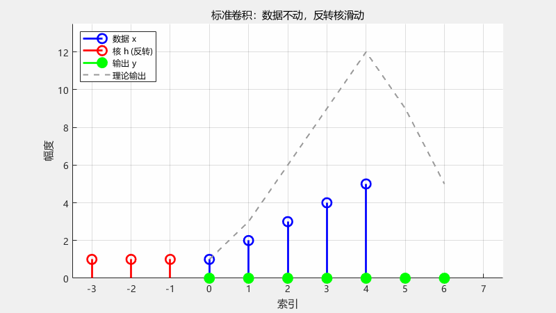
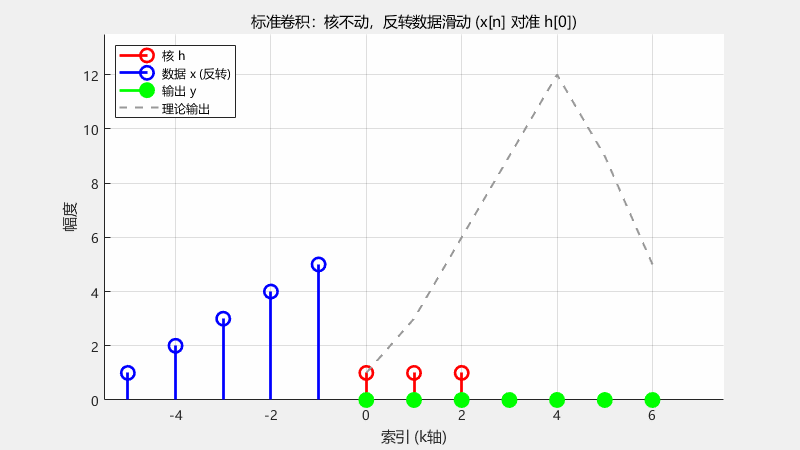

---

title: 深入浅出理解卷积的概念
published: 2026-06-30
pinned: false
description: 对卷积的另一种理解方式
tags: [Markdown, Blogging,Guides]
category: Guides
licenseName: "Unlicensed"
author: 奶黄包-CrowVoice
draft: false
date: 2026-06-30
pubDate: 2026-06-30

---

# 前言

在信号处理中，卷积是一种必学的数学计算技巧。但是由于在学习卷积的过程中需要不断接触许多较为复杂的公式，本人在学习卷积的过程中发现网上虽然有很多关于卷积的通俗解释，但是关于不少细节上仍然缺少通俗易懂的例子，初学者学习完后或许会出现一知半解的情况，故写下此文章用通俗易懂的方式解释卷积。

# 常见数学形式

## 连续卷积

对于两个连续函数 $f(t)$ 和 $h(t)$，其卷积定义为：

$$
(f * h)(t) = \int_{-\infty}^{\infty} f(\tau) \, h(t - \tau) \, d\tau
$$

## 离散卷积

对于两个离散序列$f[n]$和$h[n]$，其卷积定义为：

$$
(f * h)[n] = \sum_{k=-\infty}^{\infty} f[k] \, h[n - k]
$$

## 卷积数学公式的简单理解

在深入理解卷积之前，只需简单记住：**卷积其实就是在以时间为自变量的函数图像上一个原地不动的系统响应$h(t)$(连续形式)、$h[n]$(离散形式)与一个反转的未经处理的输入序列$f(t)$(连续形式)、$f[n]$(离散形式)相乘后乘积的累加。**

以上概念只需简单记住就行，后续会围绕以上概念解释卷积。

# 卷积的运算流程

卷积的数学公式看着复杂，其实如果能结合图像理解的话会简单很多。

---

## **视角一：数据不动，反转的核滑动**

**直觉**：把卷积核想象成一个固定好顺序的“操作序列”（例如最新的输入乘 $h[0]$、前一个乘 $h[1]$、再前一个乘 $h[2]$…）。为了让这个序列按时间正序作用在数据上，我们需要先将核反转，然后让它像一列反向滑过的窗口，依次覆盖数据。

**数学公式**：

$$
 y[n] = \sum_{k} x[k]h[n - k] 
$$

- $x[k]$ 是**固定不动的信号**（通常索引 k 从 0 开始）。
- $h[k]$ 先被反转（变成 $h[−k]$），再平移 n，形成滑动窗口 $h[n−k]$。
- 对应动画：红色反转核 `[h[2], h[1], h[0]]` 从左向右滑过蓝色数据。

---

## **视角二：核不动，反转的数据滑动**

**直觉**：把卷积核视为一个“固定的接收器”，每一时刻我们只关心当前输入 $x[n]$ 对准 $h[0]$。为了同时看到多个过去的输入，我们把整个数据序列反转，然后整体滑动，让当前时刻的样本 $x[n]$正好对准 $h[0]$，更早的样本则依次对准 $h[1]$,$h[2]$...。

**数学公式**：

$$
y[n] = \sum_{k} x[n - k]h[k] 
$$

- 固定核 $h[k]$（索引 k=0,1,2… 对应权重 $h[0]$,$h[1]$,$h[2]$）。
- 反转后的数据为 $x[n−k]$：当 $k=0$ 时是当前输入 $x[n]$，$k=1$ 时为上一时刻输入 $x[n−1]$，以此类推。
- 对应动画：蓝色反转数据 `[x[4], x[3], x[2], x[1], x[0]]` 从左向右滑动，使 $x[n]$始终对准红色的 h[0]。

## **为何两种视角等价？—— 交换律**

卷积的交换律保证了两种顺序的积分/求和结果完全相同：

$$
(x*h)[n] = \sum_{k} x[k]h[n - k] = \sum_{k} x[n - k]h[k] = (h*x)[n]
$$

视角一反转的是**卷积核**，视角二反转的是**数据**。无论哪一种，实质都是**相同的加权和**，只是观察坐标的选择不同。

# 理解卷积过程

设想我们需要设计一个系统，它对每一个新的输入样本，都按照一套固定的**处理步骤**来加工过去的数据。

比如有三个步骤：

1. 取出**当前最新的**数据，乘以权重 a
2. 取出**上一个**数据，乘以权重 b
3. 取出**再上一个**数据，乘以权重 c

如果按照自然的时间方向，我们会把步骤列表写成：

$$
步骤清单=[a,b,c]
$$

因为现实都是因果系统，所以实际情况是将步骤c最新数据对齐的。

所以步骤 a 是处理**最旧的数据**，步骤 c 才是处理**最新的数据**。

现在，当我们把这个清单直接“扣”在数据序列上，做逐点相乘再求和时，会发生什么？

清单的最后一个元素$c$会落在当前最新的数据$x[n]$上，第二个元素$b$落在$x[n−1]$上，第一个元素$a$落在$x[n−2]$上，于是计算出来的结果是：

$$
c⋅x[n]+b⋅x[n−1]+a⋅x[n−2]
$$

这完全颠倒了我们想要的操作：最新的输入被最旧的步骤处理，最旧的输入反而被最新的步骤处理。

问题出在哪里？—— **清单的顺序和时间的顺序是反的**。

这就好比一个工厂赚钱，正常流程是制造$\to$包装$\to$发货。但是此时步骤流程反了，原材料还没制造就寄出去了，已经包装好的产品又回炉重造了。

为了让步骤清单按照正确的时间关系作用在数据上，我们必须**将步骤清单反转**，变成：

$$
[c,b,a]
$$

反转后，未反转前的第一个元素$a$就会落在当前数据$x[n]$上，第二个$b$落在$x[n−1]$上，第三个$c$落在$x[n−2]$上，结果正是我们想要的：

$$
a⋅x[n]+b⋅x[n−1]+c⋅x[n−2]
$$

这个“反转步骤清单”的动作，就是卷积运算中的**核反转**。

因为现实中的因果系统只能根据过去和现在的输入产生输出，不可能预知未来，所以**处理步骤必须按从新到旧的顺序作用**（最新数据乘第一个权重，较早数据乘后面的权重）。而我们人类习惯按时间增长的顺序列出步骤（从旧到新），这就必然导致我们在直接使用清单时，需要先将它反转。

这种必然性也自然衍生出两种观察方式：

- **视角一**：数据不动，把步骤清单反转后得到的核序列，在数据轴上从过去滑向现在，每覆盖一段就完成一次处理。
- **视角二**：核固定不动，把整个数据序列反转（让最新样本对准第一个权重），然后整体平移，等价地实现同样的加权。